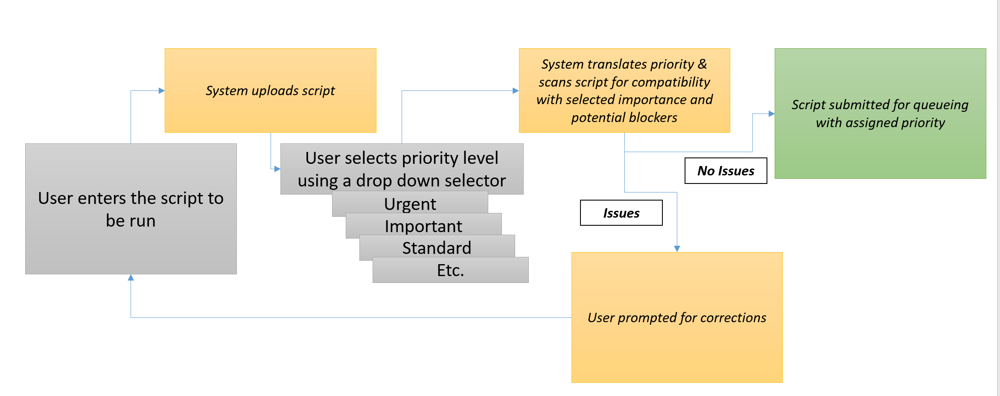

# Project Specifications

#### A project that allows a user to enter a script and select a priority level for the task that is spawned from the script. The system scans the script for potential queue-blocking issues and then submits the task for queuing.

### Interface

#### Underlying processes
1. Priority is linear and relative but completely customizable (1-10, -10-10, 0-1000, -1000-1000, etc.)
2. Interface is mapped in a relative manner to the priority numbering scheme
3. TasksToBeRun list is sorted on priority before each dequeue
  

